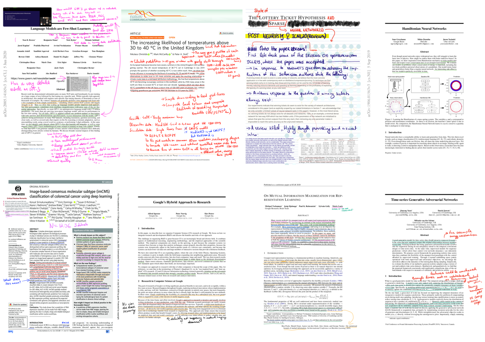

# Annotated papers :pencil:

Tracks research papers, articles and their topics read since July 2020 :+1:, and some that were read prior to July 2020

     
    
     

## Topics 

Every badge is a topic with the count of articles associated with that topic. Colour represents if the number of read articles with that topic is below (red) or above (blue) average count. 

                                   

# Completed Articles
|         Author          |                                                                             Title                                                                             | Year |                                                 Topics                                                 |
|-------------------------|---------------------------------------------------------------------------------------------------------------------------------------------------------------|-----:|--------------------------------------------------------------------------------------------------------|
| Wang et al.             | SAR-to-Optical Image Translation Using Supervised Cycle-Consistent Adversarial Networks                                                                       | 2019 | generative adversarial networks, remote sensing                                                        |
| Morcos et al.           | One ticket to win them all: generalizing lottery ticket initializations across datasets and optimizers                                                        | 2019 | sparse neural networks, lottery ticket hypothesis                                                      |
| Frankle et al.          | The Early Phase of Neural Networks Training                                                                                                                   | 2020 | deep learning ablation study, deep learning properties, sparse neural networks                         |
| Sculley et al.          | Hidden Technical Debt in Machine Learning Systems                                                                                                             | 2015 | research engineering processes                                                                         |
| Li et al.               | Measuring the Intrinsic Dimension of Objective Landscapes                                                                                                     | 2018 | deep learning properties                                                                               |
| Spector et al.          | Google’s Hybrid Approach to Research                                                                                                                          | 2012 | research engineering processes                                                                         |
| Ben Haim et al.         | Inundation Modeling in Data Scarce Regions                                                                                                                    | 2019 | hydrology, remote sensing, deep learning                                                               |
| Rasp et al.             | WeatherBench A benchmark dataset for data-driven weather forecasting                                                                                          | 2019 | weather systems, deep learning                                                                         |
| Hjelm et al.            | Learning deep representations by mutual information estimation and maximisation                                                                               | 2019 | self-supervised learning, deep learning                                                                |
| Scher et al.            | Weather and climate forecasting with neural networks using general circulation models (GCMs) with different complexity as a study ground                      | 2019 | weather systems, deep learning                                                                         |
| Hwang et al.            | Improving Subseasonal Forecasting in the Western U.S. with Machine Learning                                                                                   | 2019 | weather systems, statistical machine learning                                                          |
| Liu et al.              | A comparison of deep learning performance against health-care professionals in detecting deseases from medical imaging: a systematic review and meta-analysis | 2019 | deep learning, medical review                                                                          |
| Frankle et al.          | The Lottery Ticket Hypothesis Finding Sparse, Trainable Neural Networks                                                                                       | 2019 | sparse neural networks, lottery ticket hypothesis                                                      |
| Greydanus et al.        | Hamiltonian Neural Networks                                                                                                                                   | 2019 | dynamical systems, deep learning properties                                                            |
| Caron et al.            | Finding winning tickets with limited (or no) supervision                                                                                                      | 2020 | sparse neural networks, lottery ticket hypothesis                                                      |
| Fruhwirt et al.         | Towards better healthcare What could and should be automated                                                                                                  | 2019 | medical review                                                                                         |
| Lucic et al.            | Are GANs Created Equal? A Large-Scale Study                                                                                                                   | 2018 | ablation study, deep learning properties, generative adversarial networks                              |
| Scher et al.            | Generalization properties of feed-forward neural networks trained on Lorenz systems                                                                           | 2019 | dynamical systems, deep learning                                                                       |
| Weyn et al.             | Can Machines Learn to Predict Weather                                                                                                                         | 2019 | weather forecasting, deep learning                                                                     |
| Kohl et al.             | A Probabilistic U-Net for Segmentation of Ambiguous Images                                                                                                    | 2018 | probabilistic deep learning, computer vision, uncertainty quantification                               |
| Lee et al.              | Harmonizing Maximum Likelihood with GANs for Multimodal Conditional Generation                                                                                | 2019 | generative adversarial networks, deep learning properties                                              |
| Levy et al.             | Preliminary Evaluation of the Utility of Deep Generative Histopathology Image Translation at a Mid-Sized NCI Cancer Center                                    | 2020 | generative adversarial networks, computational pathology                                               |
| Le et al.               | Fastfood Approximating Kernel Expansion in Log Linear Time                                                                                                    | 2013 | machine learning, kernel methods                                                                       |
| Franceschi et al.       | Unsupervised Scalable Representation Learning for Multivariate Time Series                                                                                    | 2019 | self-supervised learning, time series                                                                  |
| Lee et al.              | Training Confidence-calibrated Classifiers for Detecting Out-of-Distribution Samples                                                                          | 2018 | deep learning properties                                                                               |
| Xu et al.               | GAN-based Virtual Re-Staining A Promising Solution for Whole Slide Image Analysis                                                                             | 2019 | generative adversarial networks, computational pathology                                               |
| Zhou et al.             | Deconstructing Lottery Tickets: Zeros, Signs and Supermasks                                                                                                   | 2019 | sparse neural networks, lottery ticket hypothesis, deep learning properties                            |
| Liu et al.              | An Intriguing Failing of Convolutional Neural Networks and the CoordConv Solution                                                                             | 2018 | deep learning properties                                                                               |
| Huang et al.            | Diversity-Aware Vehicle Motion Prediction via Latent Semantic Sampling                                                                                        | 2019 | probabilistic deep learning, uncertainty quantification                                                |
| Weyn et al.             | Improving data-driven global weather prediction using deep convolutional neural networks on a cubed sphere                                                    | 2020 | weather systems, deep learning                                                                         |
| Rivenson et al.         | Virtual histological staining of unlabelled tissue                                                                                                            | 2019 | generative adversarial networks, computational pathology                                               |
| Arbabi et al.           | Data-driven modeling of strongly nonlinear chaotic systems with non-Gaussian statistics                                                                       | 2019 | dynamical systems, weather systems, stochastic modeling                                                |
| Yoon et al.             | Time-series Generative Adversarial Networks                                                                                                                   | 2019 | time series, generative adversarial networks                                                           |
| Reyes et al.            | Sar-to-optical image translation based on conditional generative adversarial networks—Optimization, opportunities and limits                                  | 2019 | generative adversarial networks, remote sensing                                                        |
| Shafani et al.          | Adversarially Robust Transfer Learning                                                                                                                        | 2020 | adversarial learning, transfer learning, deep learning properties                                      |
| Zhu et al.              | Unpaired Image-to-Image Translation using Cycle-Consistent Adversarial Networks                                                                               | 2018 | generative adversarial networks, computer vision                                                       |
| Dueben et al.           | Challenges and design choices for global weather and climate models based on machine learning                                                                 | 2020 | weather systems                                                                                        |
| Schmidt et al.          | Distilling free-form natural laws from experimental data                                                                                                      | 2009 | dynamical systems                                                                                      |
| Frankle et al.          | Linear Mode Connectivity and The Lottery Ticket Hypothesis                                                                                                    | 2019 | sparse neural networks, lottery ticket hypothesis                                                      |
| Hagendorff              | The Ethics of AI Ethics                                                                                                                                       | 2018 | AI ethics                                                                                              |
| Renda et al.            | Comparing fine-tuning and rewinding in neural network prunning                                                                                                | 2020 | sparse neural networks, lottery ticket hypothesis                                                      |
| Wang et al.             | Picking winning tickets by preserving gradient flow                                                                                                           | 2020 | sparse neural networks, lottery ticket hypothesis                                                      |
| Yu et al.               | Playing the lottery with rewards and multiple languages: lottery tickets in RL and NLP                                                                        | 2020 | sparse neural networks, lottery ticket hypothesis, reinforcement learning, natural language processing |
| Raghu et al.            | Transfusion Understanding Transfer Learning for Medical Imaging                                                                                               | 2019 | deep learning properties, transfer learning                                                            |
| Jiang et al.            | Fantastic generalisation measures and where to find them                                                                                                      | 2020 | ablation study, deep learning properties, causal inference                                             |
| Gang et al.             | Hamiltonian Neural Networks                                                                                                                                   | 2019 | dynamical systems, deep learning properties                                                            |
| Ding et al.             | Coherence-Aware Neural Topic Modeling                                                                                                                         | 2018 | natural language processing                                                                            |
| Venkatesh Rao           | A Big Little Idea Called Legibility                                                                                                                           | 2010 | sociology, antropology                                                                                 |
| David Graeber           | Bullshit jobs                                                                                                                                                 | 2013 | sociology                                                                                              |
| Ruthanne Huising        | Can You Know Too Much About Your Ogranisation                                                                                                                 | 2019 | sociology, management                                                                                  |
| Tschannen et al.        | On Mutual Information Maximization for Representation Learning                                                                                                | 2020 | self-supervised learning                                                                               |
| Christidis et al.       | The increasing likelihood of temperature above 30 to 40 in the United Kingdom                                                                                 | 2020 | weather systems, climate modeling, statistical analysis                                                |
| Raf E.                  | A Step Toward Quantifying Independently Reproducible Machine Learning Research                                                                                | 2019 | statistical analysis, ablation study, machine learning                                                 |
| Lu et al.               | Deep Learning-based Computational Pathology Predicts Origins for Cancers of Unknown Primary                                                                   | 2020 | deep learning, computational pathology                                                                 |
| Brown et al.            | Language Models are Few-Shot Learners                                                                                                                         | 2020 | deep learning, natural language processing                                                             |
| Sirinukunwattana et al. | Image-based consensus molecular subtype (imCMS) classification of colorectal cancer using deep learning                                                       | 2020 | deep learning, computational pathology                                                                 |
| Cheng et al.            | Panoptic-DeepLab  A Simple, Strong, and Fast Baseline for Bottom-Up Panoptic Segmentation                                                                     | 2020 | deep learning, computer vision                                                                         |
